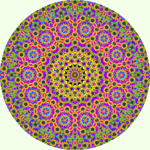

# Quasicrystal Mandalas

These images have been generated using codes in the [quasicrystal repository](https://github.com/michaelerule/quasicrystal), and then colored "by hand".

This content is licensed under the [Creative Commons Attribution Non Commercial Share Alike 3.0 license](https://creativecommons.org/licenses/by-nc-sa/3.0/) [(full license)](https://creativecommons.org/licenses/by-nc-sa/3.0/legalcode). (c) 2019 M. Rule except for rights granted under the aforementioned CC BY-NC-SA 3.0 license. 

These files can be browsed [on GitHub pages](https://michaelerule.github.io/mandalas/).

Preview images and links [are here](https://michaelerule.github.io/mandalas/Previews/).

Here are some that I like: 

<table>
<tr></tr>
<td></td>
<tr><td>

</td><td>

</td><td>

</td><td>

</td></tr><tr><td>

</td><td>

</td><td>

</td><td>

</td></tr><tr><td>

</td><td>

</td><td>

</td><td>

</td></tr><tr><td>

</td><td>

</td><td>

</td><td>

</td></tr><tr><td>

</td><td>

</td><td>

</td><td>

</td></tr><tr><td>

</td><td>

</td><td>

</td><td>

</td></tr><tr><td>

</td><td>

</td><td>

</td><td>

</td></tr><tr><td>

</td><td>

</td><td>

</td><td>

</td></tr><tr><td>

</td><td>

</td><td>

</td><td>

</td></tr><tr><td>

</td><td>

</td><td>

</td><td>

</td></tr><tr><td></td><td></td><td></td></tr>
</table>
